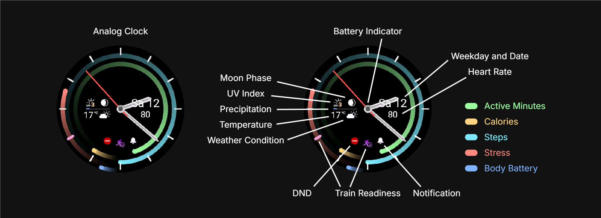

# Aion Watch Face


A modern, data-rich analog watch face for Garmin devices, designed for clarity and customizability. Aion combines a classic analog style with a comprehensive set of digital data complications, all presented in a clean, performance-optimized package.

## Screenshots



## Features

-   **Classic Analog Display**: Elegant hour, minute, and second hands. The seconds hand is visible only when the watch is active to conserve battery.
-   **Concentric Data Arcs**: Visualize your daily progress with five arcs for Body Battery, Stress, Steps, Calories, and Active Minutes.
-   **Comprehensive Data Fields**:
    -   **Right Group**: Current Date, and Heart Rate (color-coded to your HR zones).
    -   **Left Group**: Temperature, Weather Condition, Moon Phase, UV Index, and Precipitation Chance.
-   **Status Icons**: At-a-glance icons for Do Not Disturb (DND), Notifications, and Training Readiness.
-   **Battery Indicator**: A subtle arc at the top of the dial shows battery level, turning red when low and blue when charging.
-   **Dynamic Calorie Goal**: Automatically calculates a personal daily calorie goal based on your Basal Metabolic Rate (BMR) and activity level, providing a scientifically-backed target for Total Daily Energy Expenditure (TDEE).
-   **Personalized Active Minutes Goal**: Adapts to your fitness regimen by setting a daily goal derived from your weekly active minutes target in Garmin Connect.
-   **Recovery Time**: A marker on the dial indicates your next full recovery time.
-   **AMOLED Burn-In Protection**: Subtly shifts pixels periodically to protect your screen.
-   **Performance Optimized**: Pre-renders the dial and other static elements into a buffer to ensure a smooth experience and maximize battery life.
-   **Highly Customizable**: Easily change all colors via a central `Theme` module.
-   **Intelligent Data Handling**: Features smart data caching, dynamic goal calculations for calories and active minutes, and adaptive heart rate zone coloring.

## Technical Details

-   **Performance Optimization**: The dial, with all its tick marks, is pre-rendered into a bitmap buffer (`dialBuffer`) during initialization. This significantly reduces the drawing operations required in the main `onUpdate` loop, leading to better performance and lower power consumption.
-   **AMOLED Burn-In Protection**: To mitigate screen burn-in on AMOLED displays, the watch face shifts the position of all screen elements (including the pre-rendered dial) by a few pixels every few minutes.
-   **Intelligent Data Calculation**:
    -   **Calorie Goal (TDEE)**: The watch face provides a highly personalized calorie target by calculating your Total Daily Energy Expenditure (TDEE). It first determines your Basal Metabolic Rate (BMR) using the **Mifflin-St Jeor formula**, which takes your weight, height, age, and gender from your user profile. This BMR is then multiplied by an activity factor corresponding to your Garmin `activityClass` (from sedentary to extra active) to yield a precise daily calorie goal. If profile data is incomplete, the calculation is paused.
    -   **Active Minutes Goal**: To provide a relevant daily target, the watch face retrieves your `activeMinutesWeekGoal` from your user profile. It then divides this weekly goal by seven to set your daily active minutes goal shown in the arc. If a weekly goal is not set in Garmin Connect, it defaults to 30 minutes per day.
    -   **Heart Rate Zones**: Colors the heart rate display based on your specific zones set in Garmin Connect. If zones are not available, it falls back to an age-based estimation (`220 - age`).
    -   **Data Caching**: All sensor and web data is cached with specific expiration times to minimize battery drain from frequent polling.

## Configuration

All colors are defined in `source/common/Theme.mc`. You can easily modify the values in this file to create your own personalized theme.

## Permissions Explained

Aion requires the following permissions to function correctly:

-   **`SensorHistory`**: Used to access historical data for metrics like Body Battery and Stress Level.
-   **`UserProfile`**: Used to access your Heart Rate Zones for accurate color-coding and to retrieve your age, weight, height, and gender for the personalized TDEE calorie goal calculation.

## Installation

To build and install this watch face, you will need to set up the Garmin Connect IQ SDK.

1.  **Prerequisites**:
    -   Install the [Garmin Connect IQ SDK](https://developer.garmin.com/connect-iq/sdk/).
    -   Configure Visual Studio Code with the [Monkey C extension](https://marketplace.visualstudio.com/items?itemName=garmin.monkey-c).

2.  **Clone the Repository**:
    ```bash
    git clone git@github.com:Anemosx/aion.git
    cd aion
    ```

3.  **Build and Run**:
    -   Open the project in Visual Studio Code.
    -   Use the `F5` key or the "Run and Debug" panel to build and start the watch face in the simulator.
    -   To build for a physical device, use the `Ctrl+F5` (or `Cmd+F5`) command and select your target device. Then, sideload the generated `.prg` file to your device's `GARMIN/Apps` folder.

## Compatibility

This watch face is compatible with devices supporting Connect IQ API Level 5.1.0 or higher.

### Supported Devices

-   **D2™**: Mach 1
-   **Enduro™**: 3
-   **epix™**: Gen 2, Pro (42mm, 47mm, 51mm)
-   **fēnix®**: 7, 7 Pro, 7S, 7S Pro, 7X, 7X Pro, E, 8 (43mm, 47mm), 8 Solar (47mm, 51mm)
-   **Forerunner®**: 255, 255 Music, 265, 570 (42mm, 47mm), 955, 965, 970
-   **MARQ®**: Gen 2 (Athlete, Adventurer, Captain, Golfer, Carbon Edition, Commander, Aviator)
-   **Venu®**: 3, 3S
-   **vívoactive®**: 5, 6

*For a detailed list of product IDs, please refer to the `manifest.xml` file.*

## Author

**Arnold Unterauer**
